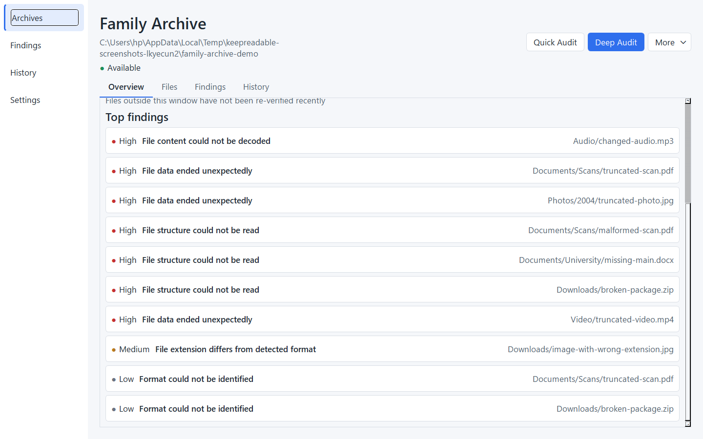
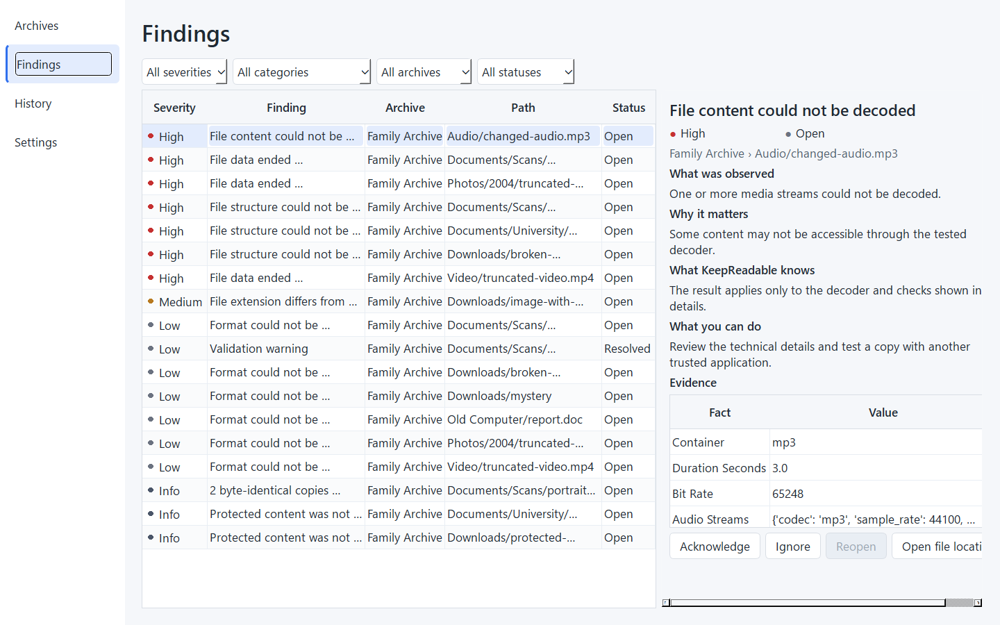
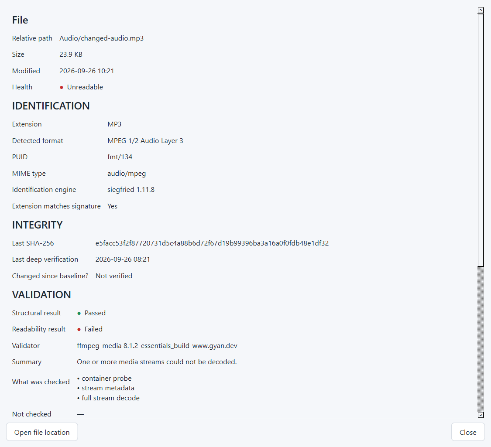
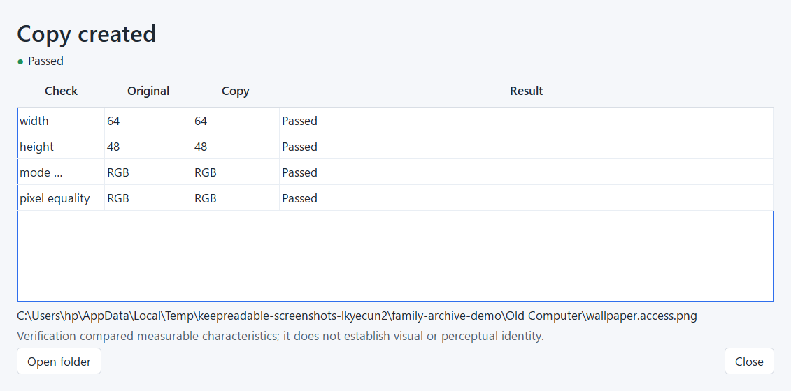
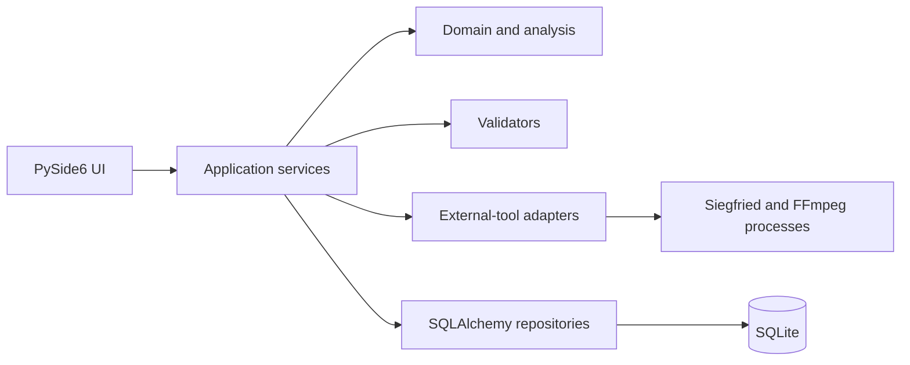

# KeepReadable

KeepReadable is a Python desktop application that audits personal digital archives for corruption, unreadable files and format risks, then creates verified compatibility copies without modifying the originals.









## The problem

A file can exist on disk while its contents are difficult or impossible to read. Extensions can be wrong. Containers can be incomplete. Checksums can change. Old formats can require software that is no longer convenient to use.

KeepReadable records evidence about what was checked. It does not replace a backup or make unsupported claims about future access.

## What KeepReadable does

- **IDENTIFY** — identifies file formats with Siegfried and PRONOM signatures.
- **VERIFY** — checks structure, decoding, checksums, and policy evidence according to the audit mode and validator tier.
- **PRESERVE** — creates optional compatibility copies and verifies measurable source/output characteristics before retaining them.
- **MONITOR** — keeps historical observations, reconciles findings, and highlights byte changes, missing files, moves, and duplicates.

## Why a backup is not enough

A backup answers whether another copy exists. It does not necessarily show whether the file can still be identified, parsed, decoded, or opened with available software. KeepReadable complements backup practice by recording local validation and integrity evidence. Originals and backups remain separate responsibilities.

## Main features

- Quick and Deep audits with deterministic scan planning.
- Streaming SHA-256 without loading whole files into memory.
- PRONOM identification through pinned Siegfried signatures.
- Image, ZIP, PDF, OOXML, and media validators.
- Evidence-based health states: Healthy, Review, Unreadable, and Unknown.
- Resumable batched processing with pause, cancellation, and disconnected-drive handling.
- Historical observations and finding reconciliation across runs.
- Verified BMP-to-PNG and AVI/MOV-to-MP4 compatibility copies.
- Self-contained HTML and PDF audit reports.
- Local SQLite storage and a PySide6 desktop workspace.
- Headless CLI and Windows one-folder package.

## Workflow

1. Add an archive folder.
2. Run a Quick Audit for format identification and structural evidence.
3. Run a Deep Audit for checksums and full validator work.
4. Review findings and technical evidence.
5. Create a compatibility copy when an available operation is useful.
6. Generate an HTML or PDF report.
7. Re-audit later to compare observations and policy decisions.

## Technical highlights

- A pure scan planner chooses work from metadata, prior evidence, policy version, signature version, and verification age.
- Discovery and persistence are streamed in bounded batches.
- A worker pool performs hashing and validation; media decoding has a separate semaphore.
- Siegfried receives UTF-8 path lists in 1,000-file identification batches.
- Validator tiers separate deep validation, structural validation, and identify-only support.
- Compatibility copies use temporary output, deep output analysis, measurable comparisons, exclusive final-name reservation, and atomic replacement.
- Observations are append-only history records. File records retain the latest baseline and health state.
- Findings are refreshed, acknowledged, ignored, reopened, or resolved without duplicating current evidence.

## Architecture



Dependencies point from the UI toward application and core layers. Domain objects do not import application infrastructure. Only `keepreadable.ui` and `keepreadable.app` import PySide6.

See [docs/ARCHITECTURE.md](docs/ARCHITECTURE.md).

## Format support

| Tier | Scope | Examples |
|---|---|---|
| Tier 1: Deep | Structure plus deep content or decode checks | JPEG, PNG, TIFF, BMP, MP3, WAV, FLAC, MP4, MOV, AVI, PDF, ZIP |
| Tier 2: Structural | Package structure, XML parsing, and application-library loading | DOCX, XLSX, PPTX |
| Tier 3: Identify only | PRONOM identity and policy evidence without a deep readability validator | Other formats matched by the installed signature set |

See [docs/FORMAT_SUPPORT.md](docs/FORMAT_SUPPORT.md) for the generated matrix and policy entries.

## Safety model

- Archive discovery, hashing, identification, and validation open originals read-only.
- The audit engine never renames, moves, deletes, or rewrites originals.
- ZIP validators inspect entries but never extract them.
- Reparse points are not followed by default.
- Compatibility copies are new files with distinct `.access` names, written through a temporary-file and verification pipeline; the destination can never resolve to the original.
- Subprocesses use argument lists, `shell=False`, timeouts, bounded output, and cancellation cleanup.
- File contents remain local.

See [docs/SAFETY.md](docs/SAFETY.md).

## Testing

The repository currently collects 277 tests.

| Group | Collected | Command |
|---|---:|---|
| Default selection | 275 | `python -m uv run pytest -q` |
| CI unit/integration selection | 252 | `python -m uv run pytest -q -m "not external_tools and not e2e and not packaged and not benchmark"` |
| External tools or E2E | 23 | `python -m uv run pytest -q -m "external_tools or e2e"` |
| External tools | 21 | `python -m uv run pytest -q -m external_tools` |
| E2E | 5 | `python -m uv run pytest -q -m e2e` |
| UI | 14 | `python -m uv run pytest -q -m ui` |
| Benchmark | 1 | `python -m uv run pytest -q -m benchmark` |
| Packaged application | 1 | `python -m uv run pytest -q -m packaged` |

Quality checks:

```text
python -m uv run ruff format --check .
python -m uv run ruff check .
python -m uv run mypy src
```

## Stack

- Python 3.12
- PySide6 6.11
- SQLAlchemy 2.0 and SQLite
- pydantic 2
- Pillow, pikepdf, pypdf
- python-docx, openpyxl, python-pptx
- PyYAML, Jinja2, reportlab, defusedxml, platformdirs
- Siegfried 1.11.8 with PRONOM DROID V125 and container signature 20260119
- FFmpeg 8.1.2 gyan.dev essentials build
- pytest, pytest-qt, Ruff, mypy, pip-audit, and PyInstaller for development and release checks

## Development setup

Requires Python 3.12 and Git.

```text
python -m uv sync --group dev
python -m uv run python scripts/bootstrap_tools.py --yes
python -m uv run keepreadable
```

CLI examples:

```text
python -m uv run keepreadable-cli tools
python -m uv run keepreadable-cli add "Family Archive" C:\Archives\Family
python -m uv run keepreadable-cli audit C:\Archives\Family --mode deep --json
python -m uv run keepreadable-cli report 1 --out C:\Reports --format both
```

Development utilities:

```text
python -m uv run python scripts/create_demo_archive.py tests/.tmp/demo --media --manifest
python -m uv run python scripts/capture_screenshots.py --out docs/screenshots
python -m uv run python scripts/benchmark_scan.py --files 10000 --out docs/benchmarks/bench-10000.json
python -m uv run python scripts/generate_format_support.py
python -m uv run python scripts/build_windows.py
```

The CLI supports `tools`, `bootstrap`, `archives`, `add`, `audit`, `resume`, `report`, and `findings`. Commands that use application data accept `--data-dir`. `KEEPREADABLE_DATA_DIR` provides an environment override.

## Packaged app

The Windows artifact is `dist/KeepReadable-0.1.0-windows-x64.zip`.

1. Unzip the complete archive to a writable folder.
2. Run `KeepReadable.exe` for the desktop application.
3. Use `KeepReadable-cli.exe` from Command Prompt or PowerShell for headless commands.
4. Application data is stored in `%LOCALAPPDATA%\KeepReadable` by default.
5. Install pinned external tools from **Settings → Install missing tools** when needed.

Siegfried and FFmpeg are downloaded on demand instead of being redistributed in the ZIP. The downloads use HTTPS, pinned checksums, and member allow-lists. The executable is unsigned, so Microsoft Defender SmartScreen may show a warning.

## Privacy

- Account required: **No**
- Cloud upload: **No**
- Remote processing: **No**
- File contents transmitted: **No**
- Telemetry: **No**

The only application network activity is a user-approved download of pinned external tools. Audit evidence and settings remain in the local data directory.

## Known limitations

- The packaged release currently targets Windows x64.
- The packaged executable is unsigned.
- Quick Audit is not an integrity verification.
- Tier 3 formats are identification-only.
- Validators check structure and decodability, not visual fidelity.
- A truncated file may be both unidentified and unreadable.
- Compatibility-copy verification compares measurable characteristics only.
- The format policy registry is intentionally small and conservative.
- Scheduled audits are not implemented.
- Two symlink tests require the Windows `SeCreateSymbolicLinkPrivilege` privilege.
- External tools are installed on demand.

## Future direction

Possible future work includes more validators, additional compatibility-copy operations, richer historical comparisons, signed Windows releases, and optional scheduling. Each addition would keep the local-first and immutable-originals model.

## License

KeepReadable is licensed under the MIT License. See [LICENSE](LICENSE).
