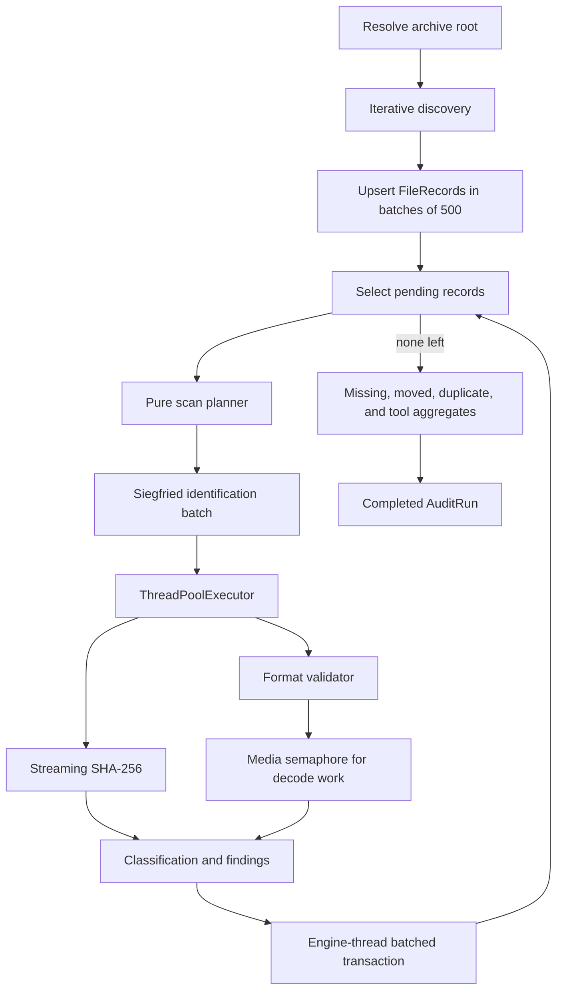
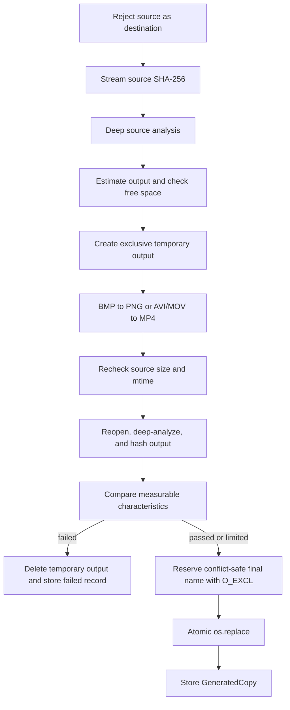
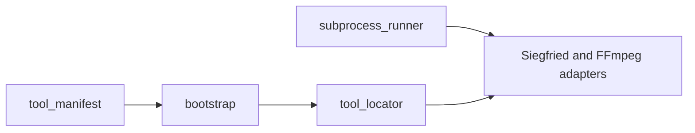

# Architecture

## Dependency direction

KeepReadable uses a layered desktop architecture:

```text
ui → application → domain / analysis / validators / integrations / persistence
```

The domain package imports no other KeepReadable layer. Analysis code is independent of Qt and SQLAlchemy. Only `keepreadable.ui` and `keepreadable.app` import PySide6. Persistence converts between SQLAlchemy models and plain domain dataclasses.

## Module map

| Package | Responsibility | Main modules |
|---|---|---|
| `domain` | Immutable records and shared enums | `archive`, `audit`, `file_record`, `observation`, `finding`, `preservation`, `health` |
| `analysis` | Pure planning, classification, hashing, discovery, identity, ETA, and finding reconciliation | `planner`, `classification`, `discovery`, `hashing`, `archive_identity`, `findings`, `eta` |
| `validators` | Format-specific structure and readability evidence | `images`, `zip_archive`, `pdf`, `ooxml`, `media`, `registry` |
| `integrations` | External process, manifest, location, bootstrap, Siegfried, and FFmpeg boundaries | `subprocess_runner`, `tool_locator`, `tool_manifest`, `bootstrap`, `siegfried`, `ffmpeg` |
| `persistence` | SQLite engine, SQLAlchemy schema, and repositories | `database`, `models`, `repositories` |
| `policies` | Versioned format-access guidance | `registry`, `formats.yml` |
| `application` | Use cases and transaction coordination | `audit_service`, `archive_service`, `file_service`, `findings_service`, `preservation_service`, `report_service`, `container` |
| `ui` | PySide6 shell, screens, dialogs, models, workers, and controller | `main_window`, `controller`, `screens`, `dialogs`, `models`, `workers`, `widgets`, `theme` |
| `reporting` | Packaged report template | `templates/report.html.j2` |
| `config` | Settings and local paths | `settings`, `paths` |
| `utilities` | Clock, cancellation, filesystem paths, and logging | `clock`, `cancellation`, `filesystem`, `logging` |

## Audit data flow



Discovery writes FileRecords after each persistence batch and sets `resume_state.discovery_complete` only after the walk finishes. Processing selects up to 1,000 pending files. Siegfried is called once for the identification subset with `-multi` equal to the configured worker count. Workers hash and validate. The engine thread classifies results and writes observations, reconciled findings, file baselines, and run counters in one session per batch.

## Scan planner

`analysis/planner.py` applies these rules in order.

| Condition | Change and reason | Work |
|---|---|---|
| No previous observation | `NEW`, `NEW_FILE` | Full Quick or Deep plan |
| Size or mtime differs | `MODIFIED`, `METADATA_CHANGED` | Full Quick or Deep plan |
| Deep with `force_deep_all` | `UNCHANGED`, `FORCE_DEEP` | Full Deep plan |
| Deep after `CHANGED_DURING_SCAN` | `UNCHANGED`, `UNTRUSTED_PREVIOUS_RESULT` | Full Deep plan |
| Deep with no prior SHA-256 | `UNCHANGED`, `NEVER_DEEP_VERIFIED` | Full Deep plan |
| Deep after FAILED or UNAVAILABLE validation | `UNCHANGED`, `PREVIOUS_FAILURE` | Full Deep plan |
| Deep verification is at least the configured interval old | `UNCHANGED`, `OVERDUE_DEEP_VERIFICATION` | Full Deep plan |
| Signature version changed or prior format was unidentified | `UNCHANGED`, `SIGNATURE_UPDATED` | Identify and classify; Quick also checks structure; Deep reuses validation |
| Quick after FAILED, WARNING, or UNAVAILABLE validation | `UNCHANGED`, `PREVIOUS_FAILURE` | Full Quick plan |
| Otherwise | `UNCHANGED_RECENT` or `UNCHANGED_QUICK` | Classify only and reuse identification and validation |

Quick work is `IDENTIFY`, `QUICK_STRUCTURE`, and `CLASSIFY`. Deep work is `IDENTIFY`, `HASH`, `DEEP_VALIDATE`, and `CLASSIFY`. Policy-version differences do not add file work. Classification records policy changes separately.

## Resume mechanism

A record is pending when:

```text
file_records.last_seen_audit_id == run_id
AND no observations row exists for (run_id, file_record_id)
```

`next_pending_batch()` orders by normalized path. Each committed observation removes that record from the pending set. A paused or interrupted run can therefore restart without duplicating observations. Discovery can restart safely because the path upsert preserves `first_seen_audit_id`, refreshes metadata, and sets `present` to true.

## Pause, cancellation, and interruption

- `CancellationToken.cancel("pause")` produces a PAUSED run. It remains resumable.
- Cancellation without the pause reason produces CANCELLED. It is final.
- If the archive root becomes unavailable, the run becomes INTERRUPTED with `archive_unavailable`.
- At startup, `recover_interrupted()` changes RUNNING runs to INTERRUPTED with `application_closed`.
- Unexpected exceptions produce FAILED with a short `error_summary`; the traceback goes to the log.
- Progress is emitted by the engine thread at most every 0.25 seconds while workers are active.

If a root disconnects, the engine saves completed batches and does not mark unseen records missing. Final missing-file processing runs only after discovery completed and the root is available.

## Concurrency model

Each processing batch owns a `ThreadPoolExecutor(worker_count)`. Workers only stat, hash, and validate files. `BoundedSemaphore(media_decode_workers)` limits concurrent media decodes. Workers never write audit database rows. The engine thread performs all persistence and finding reconciliation after worker results are collected.

The default worker count is `min(4, cpu_count)`. The media decode default is 2. Identification batches contain up to 1,000 records. Discovery persistence batches contain 500 records.

## UI and worker communication

`AuditController` owns exactly one `AuditWorker`. `AuditWorker` is a `QThread` with its own cancellation token. The engine's progress callback emits a Qt signal; queued delivery moves the update to the UI thread. Screens subscribe to controller progress, finished, failed, and running-state signals. Pause and Cancel call the token methods without blocking the UI. `TaskWorker` handles shorter background tasks such as report generation and file-count estimates. `BootstrapWorker` streams tool-download progress.

## Compatibility-copy pipeline



BMP-to-PNG compares dimensions, compatible modes, and RGBA pixels. AVI/MOV-to-MP4 compares duration, streams, audio presence, dimensions, frame rate, and full decode. Video conversion uses H.264/AAC and is explicitly lossy. Failures and cancellations delete temporary output and retain a GeneratedCopy evidence row with a null output path.

## Persistence schema

| Table | Purpose | Key constraints and indexes |
|---|---|---|
| `archives` | Registered roots and volume identity | Root fingerprint index |
| `audit_runs` | Run status, counters, versions, and resume state | `(archive_id, status)` |
| `file_records` | Current path, metadata, health, format, and checksum baseline | Unique `(archive_id, normalized_path)`; `(archive_id, present)`; `(archive_id, last_sha256)` |
| `observations` | Per-file evidence for each run | `(file_record_id, created_at)`; `audit_run_id`; `(audit_run_id, file_record_id)` |
| `findings` | Stateful evidence requiring review | `audit_run_id`; `file_record_id`; `state` |
| `generated_copies` | Compatibility-copy operation and verification evidence | Source FileRecord foreign key |
| `schema_meta` | Schema version | Primary key `key` |

SQLite foreign keys are enabled. File databases use WAL and `synchronous=NORMAL`. Sessions commit on success and roll back on exceptions.

## External-tool abstraction



The runner enforces list arguments, `shell=False`, bounded stdout/stderr, cancellation, and timeouts. Adapters parse tool-specific output into typed evidence. The locator checks environment overrides, the current data directory, the default per-user directory, a frozen bundle, and PATH. Bootstrap downloads only pinned HTTPS artifacts, verifies SHA-256, and extracts allow-listed members.
